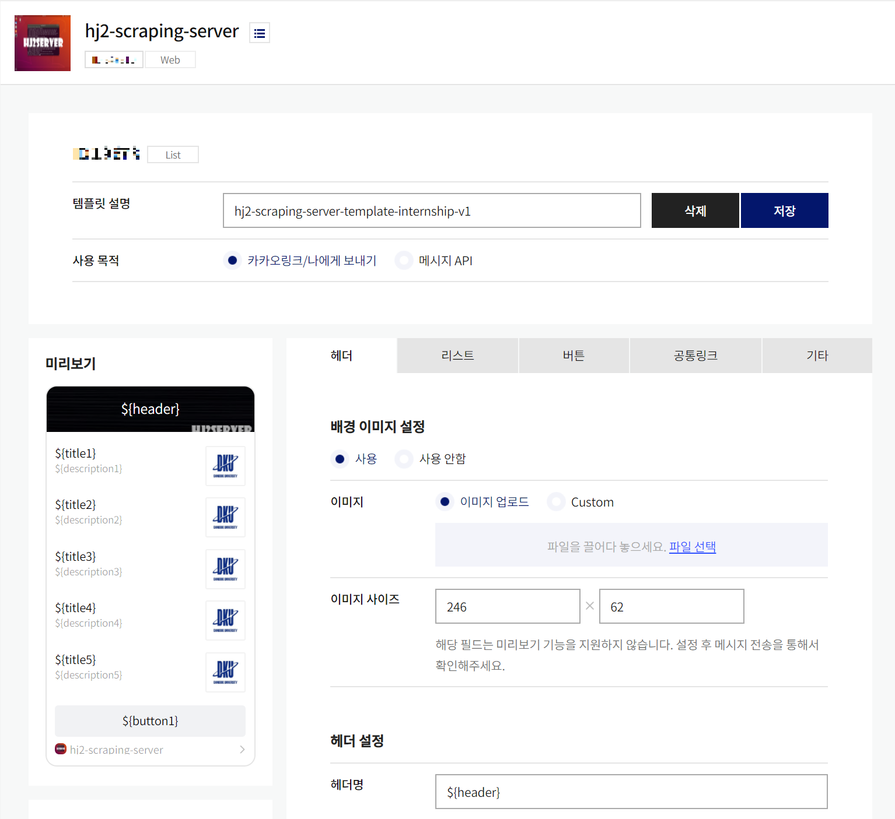
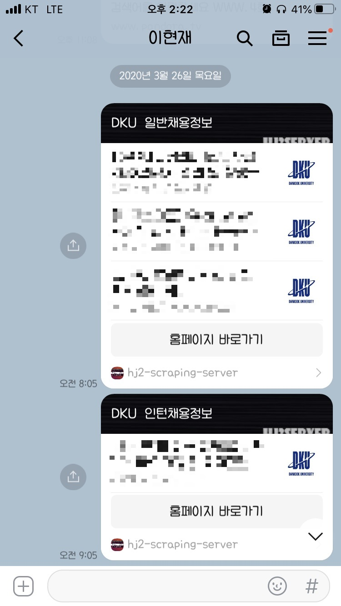

### 채용 정보 알림기 (with 카카오톡)

카카오톡 메신저로 채용 정보에 대한 알림(08:05, 09:05, 2회)을 받는다.

**구조**  

**`/`**
- 데이터 수집
  - `dku_crawler_internship.py`
  - `dku_crawler_normal.py`
- 데이터 전송 (카카오톡)
  - `dku_crawler_internship_kakaotalk.py`
  - `dku_crawler_normal_kakaotalk.py`

**`/data`**
- 수집된 데이터
  - `internship_posts.csv`
  - `normal_posts.csv`
- 전송된 데이터
  - `known_internship_posts.txt`
  - `known_normal_posts.txt`
- 토큰 (카카오 API)
  - `token.txt`

 

### Example 1
- 

### Example 2
- 

### Example 3
- http://hj2server.ddns.net/files/portfolio_hj-dkujob-scrapping.pdf

 

### Date
- 2019.12.05 ~ 2019.12.12 (1 week)
